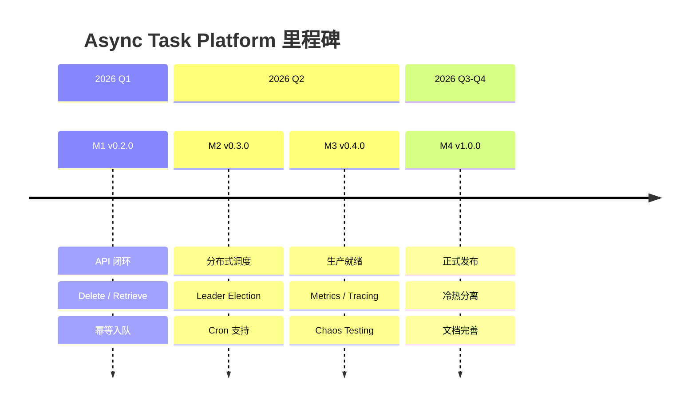

# Async Task Platform - 战略开发指南

> 本文档是项目的长期战略规划，定义了技术愿景、架构演进路径、里程碑目标和工程实践标准。
> 用于指导日常开发决策，确保每次迭代都朝着正确的方向推进。

---

## 一、项目愿景与定位

### 1.1 核心愿景

构建一个**通用异步任务调度平台**，覆盖以下三类业务场景：

| 延时任务 (Delay Queue) | 周期调度 (Cron Scheduler) | 工作流编排 (Workflow Engine) |
| :--- | :--- | :--- |
| • 订单超时关闭 | • 每日报表生成 | • 用户注册流程 |
| • 短信定时发送 | • 缓存定期刷新 | • 审批流程编排 |
| • 消息延迟推送 | • 数据定期清理 | • ETL 数据管道 |

### 1.2 差异化价值

| 维度 | 竞品现状 | 本项目目标 |
|------|---------|-----------|
| **学习价值** | 开源项目代码量大，难以通读 | 代码精简可读，配套详细文档 |
| **面试价值** | 难以解释设计决策 | 每个模块都有 ADR 记录 |
| **扩展性** | 功能固定 | 模块化设计，易于扩展 |

### 1.3 目标用户画像

1. **自己**：作为 Side Project 学习分布式系统核心概念
2. **面试官**：展示系统设计能力和工程深度
3. **潜在使用者**：需要轻量级任务调度的小型项目

---

## 二、技术架构蓝图

### 2.1 目标架构（长期愿景）

```
┌────────────────────────────────────────────────────────────────────────┐
│                              Clients                                   │
│              (gRPC SDK / REST API / Web Console)                       │
└───────────────────────────────┬────────────────────────────────────────┘
                                │
┌───────────────────────────────▼────────────────────────────────────────┐
│                           API Gateway                                  │
│                  (Rate Limiting / Auth / Routing)                      │
└───────────────────────────────┬────────────────────────────────────────┘
                                │
        ┌───────────────────────┼───────────────────────┐
        │                       │                       │
        ▼                       ▼                       ▼
┌───────────────┐       ┌───────────────┐       ┌───────────────┐
│   Scheduler   │       │    Worker     │       │   Admin API   │
│   Cluster     │       │    Fleet      │       │   Service     │
│               │       │               │       │               │
│ • Leader Elect│       │ • Auto Scale  │       │ • Dashboard   │
│ • Cron Parse  │       │ • Ack/Nack    │       │ • DLQ Manage  │
│ • Task Assign │       │ • Retry Logic │       │ • Metrics     │
└───────┬───────┘       └───────┬───────┘       └───────────────┘
        │                       │
        └──────────┬────────────┘
                   │
┌──────────────────▼──────────────────┐
│          Coordination Layer         │
│     (Redis / etcd / Zookeeper)      │
│                                     │
│  • Leader Election                  │
│  • Distributed Lock                 │
│  • Service Discovery                │
└──────────────────┬──────────────────┘
                   │
        ┌──────────┴─────────────────┐
        │                            │
        ▼                            ▼
┌─────────────────────┐     ┌────────────────┐
│  Hot Storage        │     │  Cold Storage  │
│    (Redis)          │     │   (MySQL)      │
│                     │     │                │
│ • Hourly Tasks      │     │ • Future Tasks │
│ • Running Tasks     │     │ • History      │
│ • Dead Letter Queue │     │ • Audit Logs   │
└─────────────────────┘     └────────────────┘
```

### 2.2 当前架构（MVP）

```
┌─────────────┐     ┌─────────────┐
│   Client    │────▶│   Server    │
│  (grpcurl)  │     │  (gRPC)     │
└─────────────┘     └──────┬──────┘
                           │
                    ┌──────▼──────┐
                    │   Worker    │
                    │  (Polling)  │
                    └──────┬──────┘
                           │
                    ┌──────▼──────┐
                    │    Redis    │
                    │  (Single)   │
                    └─────────────┘
```

### 2.3 架构演进路径

| 阶段 | 架构特征 | 支撑能力 |
|------|---------|---------|
| **MVP (当前)** | 单 Redis + 单 Server | < 1k TPS，学习验证 |
| **V1.0** | Redis + Leader Election | < 10k TPS，小规模生产 |
| **V2.0** | Redis Cluster + 分片 + Metrics | < 50k TPS，中规模生产 |
| **V3.0** | 冷热分离 + 工作流引擎 | 百万级任务存储 |

---

## 三、里程碑规划

### 3.1 里程碑总览



### 3.2 各里程碑详细目标

#### M1: v0.2.0 - API 闭环（2026年2月）

**验收标准**：
- [ ] `Delete` API 可用，支持按 ID 取消任务
- [ ] `Retrieve` API 可用，Worker 通过 gRPC 消费
- [ ] 幂等入队：相同 `idempotency_key` 返回已存在 Task ID
- [ ] 测试覆盖率 > 70%

**产出物**：
- 更新后的 README（API 使用示例）
- 端到端集成测试脚本

---

#### M2: v0.3.0 - 分布式调度（2026年3月-4月）

**验收标准**：
- [ ] 多 Server 实例部署时，仅一个执行 Watchdog
- [ ] 支持 Cron 表达式 `0 2 * * *` 格式
- [ ] Topic 分片，单 Topic 支持 > 10k TPS

**产出物**：
- Leader Election 设计文档 (ADR)
- 分片策略设计文档 (ADR)

---

#### M3: v0.4.0 - 生产就绪（2026年5月-6月）

**验收标准**：
- [ ] Prometheus 指标暴露 (`/metrics`)
- [ ] OpenTelemetry 链路追踪集成
- [ ] Chaos Testing 通过（Redis 断连、Worker Kill）
- [ ] Grafana Dashboard JSON 模板

**产出物**：
- 监控告警配置指南
- 故障注入测试报告

---

#### M4: v1.0.0 - 正式发布（2026年下半年）

**验收标准**：
- [ ] 冷热分离（MySQL + Redis）
- [ ] 完整的用户文档（Quick Start, API Reference, Best Practices）
- [ ] 性能压测报告（目标 > 10k TPS）

**产出物**：
- 完整 README 和 Wiki
- Benchmark 数据和方法论

---

## 四、技术决策原则

### 4.1 设计原则

| 原则 | 说明 | 实践示例 |
|------|------|---------|
| **KISS** | 保持简单，拒绝过度设计 | 先用 Redis 分布式锁，不急于引入 etcd |
| **YAGNI** | 不做暂时不需要的功能 | 冷热分离延后到有明确需求时 |
| **可测试性** | 每个模块可独立测试 | 接口抽象 + 依赖注入 |
| **可观测性** | 出问题时能快速定位 | Metrics + Tracing + Structured Logging |
| **失败友好** | 假设一切都会失败 | 重试 + 超时 + 熔断 + 降级 |

### 4.2 技术选型决策树

```
需要新功能/组件？
    │
    ├── 是否有成熟开源方案？
    │       │
    │       ├── 是 → 评估集成成本
    │       │         │
    │       │         ├── 成本低 → 直接使用
    │       │         └── 成本高 → 考虑简化版自研
    │       │
    │       └── 否 → 自研
    │                 │
    │                 └── 写 ADR 记录决策理由
    │
    └── 记录在 DEVELOPMENT_LOG.md
```

### 4.3 代码质量标准

遵循**字节跳动 Go 开发规范**，重点关注：

- 单行 ≤ 120 字符
- 函数参数 ≤ 3 个（超过则封装为 Options struct）
- 使用 `%w` 包装错误，保留错误链
- 每个导出函数必须有注释
- 禁止裸 goroutine（必须有生命周期管理）

---

## 五、开发工作流

### 5.1 日常开发流程

```
1. 认领任务 → 更新 task.md
2. 创建 feature 分支
3. 编码 + 单元测试
4. 本地通过 `make test && make lint`
5. 提交 PR → 代码审查
6. 合并到 develop
7. 更新日报
```

### 5.2 文档更新要求

| 场景 | 必须更新的文档 |
|------|---------------|
| 新增功能 | README（使用方法）+ API.md |
| 架构调整 | ARCHITECTURE.md + 新建 ADR |
| 配置变更 | config.example.yaml + README |
| Bug 修复 | CHANGELOG.md |

### 5.3 发布流程

```
1. 从 develop 切出 release/vX.Y.Z 分支
2. 更新 CHANGELOG.md
3. 更新 DEVELOPMENT_LOG.md 的 Milestones
4. CI 通过后合并到 main
5. 打 tag vX.Y.Z
6. 合并回 develop
```

---

## 六、学习路径建议

### 6.1 配合项目学习的技术点

| Phase | 学习主题 | 推荐资源 |
|-------|---------|---------|
| Phase 2 | Redis 数据结构与 Lua 脚本 | Redis in Action |
| Phase 3 | 分布式锁与 Leader Election | DDIA Chapter 8-9 |
| Phase 3 | Cron 表达式解析 | `robfig/cron` 源码 |
| Phase 4 | Prometheus 数据模型 | Prometheus Up & Running |
| Phase 4 | 分布式追踪概念 | OpenTelemetry 官方文档 |
| Phase 5 | 冷热分离与数据分层 | 各大云厂商架构博客 |

### 6.2 面试准备 Checklist

每完成一个 Phase，确保能回答：

- [ ] 为什么这样设计？有什么 Trade-off？
- [ ] 如果流量翻 10 倍，系统会怎样？如何扩展？
- [ ] 如果 Redis 挂了，会发生什么？如何恢复？
- [ ] 这个功能的时间复杂度/空间复杂度是多少？
- [ ] 遇到过什么坑？如何解决的？

---

## 七、附录

### 7.1 相关文档索引

| 文档 | 位置 | 用途 |
|------|------|------|
| 架构设计 | [ARCHITECTURE.md](../docs/ARCHITECTURE.md) | 系统组件与数据流 |
| API 参考 | [API.md](../docs/API.md) | gRPC 接口使用指南 |
| 开发日志 | [DEVELOPMENT_LOG.md](../DEVELOPMENT_LOG.md) | 变更历史与决策记录 |
| ADR 目录 | [docs/adr/](../docs/adr/) | 架构决策记录 |

### 7.2 常用命令速查

```bash
# 启动 Redis
make up

# 运行服务
make run-server
make run-worker

# 测试与检查
make test
make lint
make fmt

# 生成 Proto
make proto

# 停止服务
make down
```

---

> 📌 **重要**：本文档应随项目演进定期更新。每次重大架构调整后，请回顾并修订相关章节。
